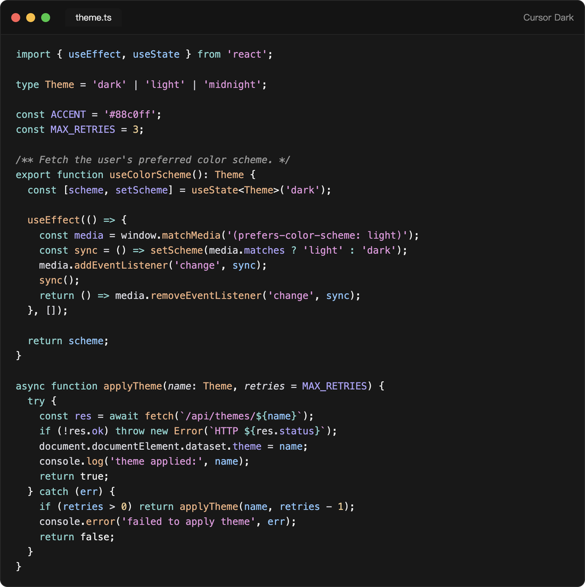
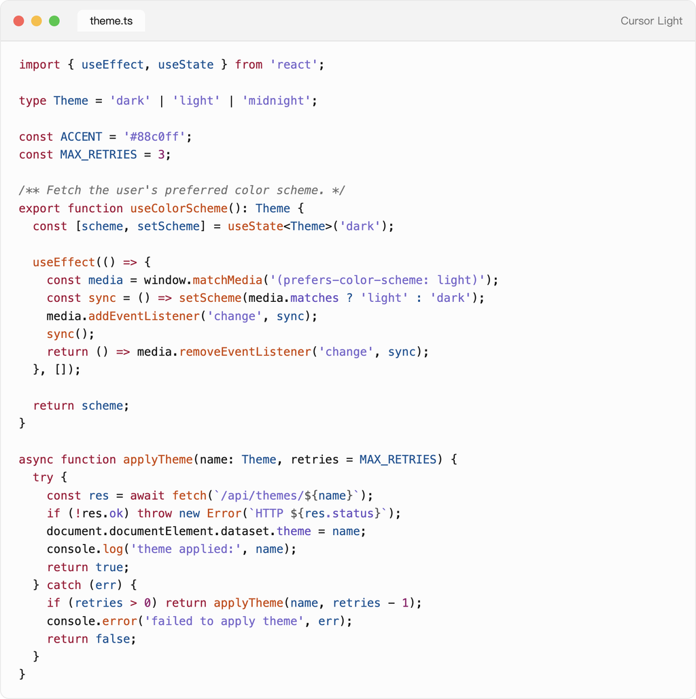
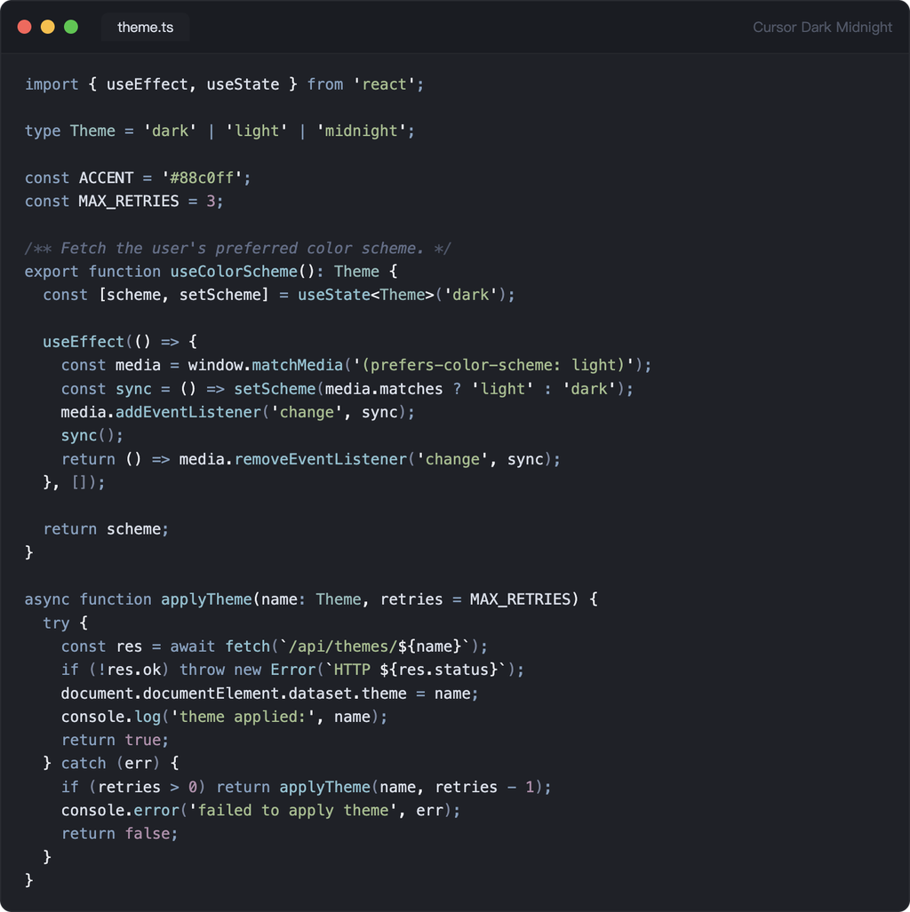
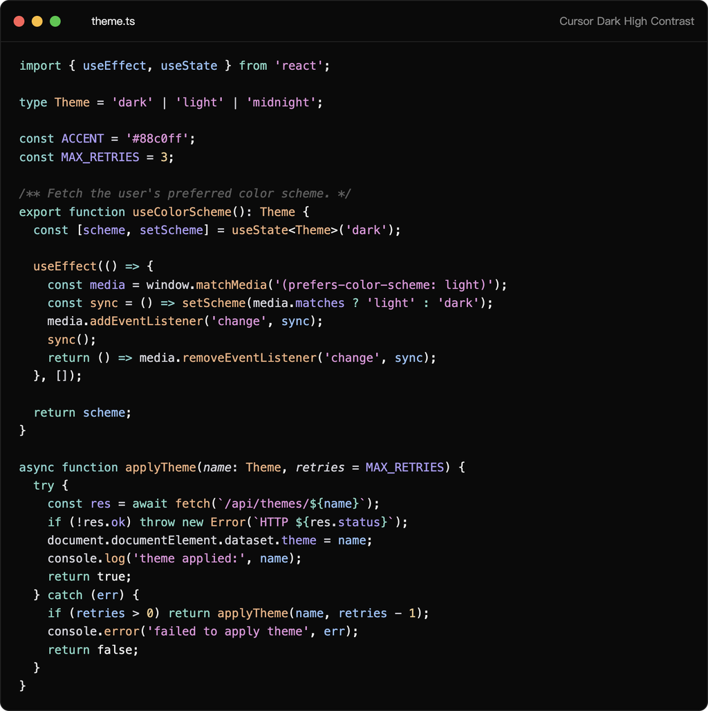
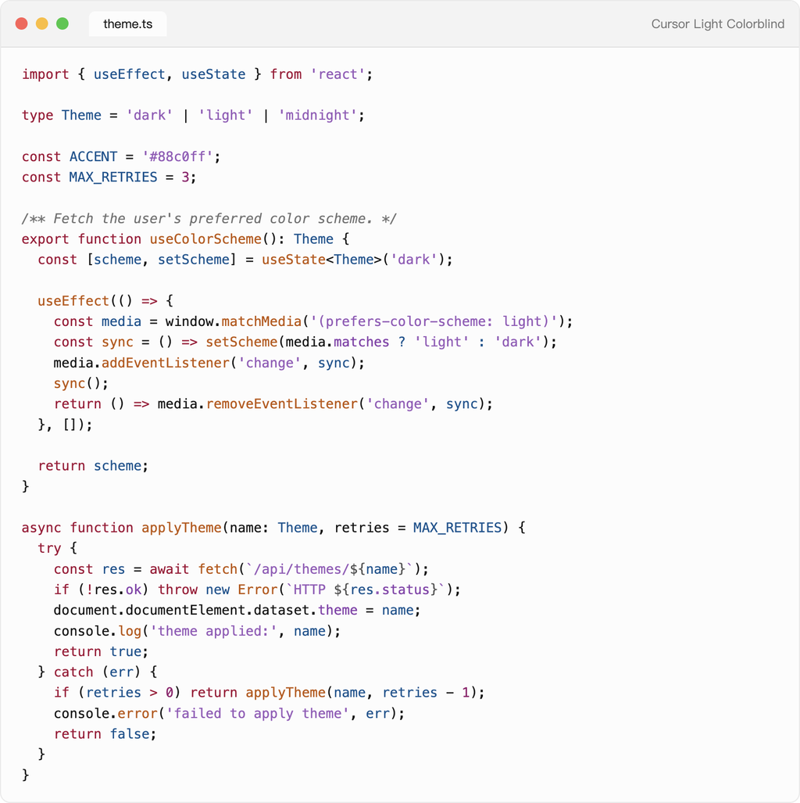

# Cursor Themes for VS Code

The [Cursor](https://cursor.com) editor's signature color themes, faithfully recreated for VS Code. Every shade — workbench chrome, terminal ANSI colors, and syntax highlighting — is matched pixel-for-pixel to the real thing, so your editor feels instantly familiar.

Five themes are included: **Cursor Dark**, **Cursor Light**, **Cursor Dark Midnight**, **Cursor Dark High Contrast**, and **Cursor Light Colorblind**.

## Cursor Dark

The default dark theme from Cursor — deep charcoal background with cool blue accents.



## Cursor Light

Cursor's light theme — clean off-white background, easy on the eyes in bright environments.



## Cursor Dark Midnight

A darker, low-contrast dark theme for late-night coding sessions.



## Cursor Dark High Contrast

Maximum-contrast dark theme for readability and accessibility.



## Cursor Light Colorblind (Beta)

A light theme tuned for color-vision deficiency, with a palette that stays distinguishable for colorblind users.



## Install

Search for **Cursor Themes** in the VS Code Extensions view (`Cmd+Shift+X`), or install from the [VS Code Marketplace](https://marketplace.visualstudio.com/items?itemName=evanlong.cursor-themes).

Then `Cmd+Shift+P` → `Preferences: Color Theme` → pick e.g. **Cursor Dark**.

To follow the system appearance (dark/light auto-switching, like Cursor does):

```jsonc
{
  "window.autoDetectColorScheme": true,
  "workbench.preferredDarkColorTheme": "Cursor Dark",
  "workbench.preferredLightColorTheme": "Cursor Light"
}
```

## Keeping the themes fresh

The themes are kept in sync with the latest Cursor releases. Each update is published to the VS Code Marketplace and as a GitHub release.
